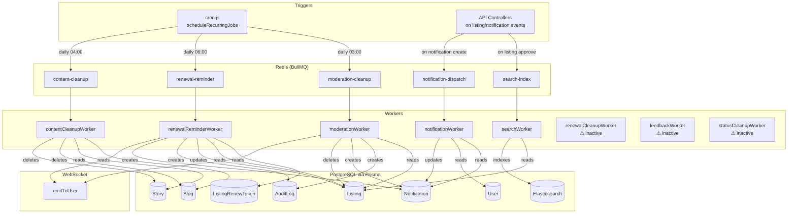

# BullMQ Workers — Complete Analysis

> Last updated: 2026-03
> Covers all workers in `src/workers/`, queue definitions in `src/jobs/queues.js`, and scheduler in `src/schedulers/cron.js`.

---

## 1. Architecture Overview

The marketplace backend uses **BullMQ** (backed by **Redis / IORedis**) as its job queue system. All workers are long-running Node.js processes that share the same Redis instance used by the main API server.

### Queue Initialization

File: `src/jobs/queues.js`

| Constant | Queue name |
|---|---|
| `MODERATION_CLEANUP` | `moderation-cleanup` |
| `SEARCH_INDEX` | `search-index` |
| `NOTIFICATION_DISPATCH` | `notification-dispatch` |
| `RENEWAL_REMINDER` | `renewal-reminder` |
| `CONTENT_CLEANUP` | `content-cleanup` |

`initQueues()` is called once at server startup. Each queue also tries to create a `QueueScheduler` for delayed/repeating job support (gracefully falls back if unavailable).

> **Note:** Three workers (`statusCleanupWorker`, `renewalCleanupWorker`, `feedbackWorker`) consume queues (`status-cleanup`, `renewal-cleanup`, `feedback-reminder`) that are **not present** in the `QUEUES` enum and therefore receive **no scheduled jobs** from `cron.js`. They are implemented but currently inactive unless jobs are enqueued externally.

---

## 2. Worker Summaries

### 2.1 Moderation Cleanup Worker

**File:** `src/workers/moderationWorker.js`
**Queue:** `moderation-cleanup`
**Triggered by:** Daily cron at `DAILY_LISTING_CLEANUP_TIME` (default `03:00`)
**Job data:** `{ cutoff: ISO string }`

**What it does:**

1. Finds all `Listing` records with `status != APPROVED` and `createdAt < cutoff` date.
2. For each: creates an `AuditLog`, creates a `Notification` (channel `SYSTEM`) for the listing owner, emits `notification:new` via WebSocket, deletes uploaded files, and hard-deletes the `Listing`.
3. **Second pass** — purges any listing whose status is neither `PENDING` nor `APPROVED` (catches stale moderation states missed by the first pass).

**Prisma models used:**

| Model | Fields read | Fields written |
|---|---|---|
| `Listing` | `id`, `title`, `status`, `userId`, `createdAt` | deleted |
| `AuditLog` | — | `listingId`, `action`, `details` |
| `Notification` | — | `title`, `message`, `channel`, `targetType`, `listingId`, `triggerEvent` |
| `NotificationRecipient` (nested) | — | `userId` |

---

### 2.2 Renewal Reminder Worker

**File:** `src/workers/renewalReminderWorker.js`
**Queue:** `renewal-reminder`
**Triggered by:** Daily cron at `DAILY_RENEWAL_REMINDER_TIME` (default `06:00`)
**Job data:** `{}` (no payload)

**What it does — two phases:**

**Phase 1 — Draft expired tokens:**

- Finds all `ListingRenewToken` records where `expiresAt < now`.
- For each associated `Listing` that is not already `DRAFT`:
  - Sets `status = DRAFT` and stores `autoDraftedAt` in `metadata`.
  - Creates an `AuditLog` (`AUTO_DRAFT_EXPIRED_TOKEN`).
  - Creates a `Notification` telling the owner the listing was auto-drafted.
  - Emits `notification:new` via WebSocket.

**Phase 2 — Send up to 3 renewal reminders:**

- Finds `ListingRenewToken` records expiring within the next 3 days.
- For each `APPROVED` listing with fewer than 3 previous `RENEWAL_REMINDER` notifications:
  - Creates a `Notification` with the expiry date.
  - Emits `notification:new` via WebSocket.

**Prisma models used:**

| Model | Fields read | Fields written |
|---|---|---|
| `ListingRenewToken` | `expiresAt`, `listingId` | — |
| `Listing` | `id`, `title`, `status`, `userId`, `metadata` | `status`, `metadata` |
| `AuditLog` | — | `listingId`, `action`, `details` |
| `Notification` | `triggerEvent`, `listingId` (count) | `title`, `message`, `channel`, `targetType`, `listingId`, `triggerEvent` |
| `NotificationRecipient` (nested) | — | `userId` |

---

### 2.3 Renewal Cleanup Worker *(inactive — queue not scheduled)*

**File:** `src/workers/renewalCleanupWorker.js`
**Queue:** `renewal-cleanup` *(not in QUEUES enum)*

**What it does:**

- Finds `Listing` records where `expiresAt < now` and `status != EXPIRED`.
- Updates each to `status = EXPIRED`.
- Creates an `AuditLog` (`MARK_EXPIRED`).

**Prisma models used:**

| Model | Fields read | Fields written |
|---|---|---|
| `Listing` | `id`, `expiresAt`, `status` | `status` |
| `AuditLog` | — | `listingId`, `action`, `details` |

---

### 2.4 Content Cleanup Worker

**File:** `src/workers/contentCleanupWorker.js`
**Queue:** `content-cleanup`
**Triggered by:** Daily cron at `DAILY_BLOG_STORY_CLEANUP_TIME` (default `04:00`)
**Job data:** `{ cutoff: ISO string, types?: ['story', 'blog'] }`

**What it does:**

- For each type in `types` (defaults to both `story` and `blog`):
  - **Stories:** Deletes all `StoryImage` children, then deletes the `Story`, then removes uploaded files.
  - **Blogs:** Deletes all `BlogComment` children, then deletes the `Blog`, then removes uploaded files.
- The `cutoff` date is computed as `now - BLOG_STORY_KEEP_DAYS` (default 30 days).

**Prisma models used:**

| Model | Fields read | Fields written |
|---|---|---|
| `Story` | `id`, `createdAt` | deleted |
| `StoryImage` | `storyId` | deleted |
| `Blog` | `id`, `createdAt` | deleted |
| `BlogComment` | `blogId` | deleted |

---

### 2.5 Notification Dispatch Worker

**File:** `src/workers/notificationWorker.js`
**Queue:** `notification-dispatch`
**Triggered by:** Enqueued on-demand when a notification must be delivered externally
**Job data:** `{ notificationId: string }`

**What it does:**

- Loads the full `Notification` (with `recipients` and `listing`).
- For each `NotificationRecipient`:
  - If channel is `WHATSAPP`: fetches the user's `phone` and calls `sendWhatsApp()`.
  - If channel is `EMAIL`: fetches the user's `email` and calls `sendEmail()`.
  - Updates `NotificationRecipient.deliveredAt` on success, or `deliveryError` on failure.
- Marks `Notification.sentAt = now`.

**Prisma models used:**

| Model | Fields read | Fields written |
|---|---|---|
| `Notification` | `id`, `channel`, `title`, `message`, `recipients` | `sentAt` |
| `NotificationRecipient` | `id`, `userId` | `deliveredAt`, `deliveryError` |
| `User` | `phone`, `email` | — |

---

### 2.6 Feedback Reminder Worker *(inactive — queue not scheduled)*

**File:** `src/workers/feedbackWorker.js`
**Queue:** `feedback-reminder` *(not in QUEUES enum)*

**What it does:**

- Finds listings with `status IN ('SOLD', 'RENTED')` where `soldOrRentedAt < (now - feedbackReminderDays)`.
- Creates a `Notification` (channel `SYSTEM`) requesting owner feedback.

**Prisma models used:**

| Model | Fields read | Fields written |
|---|---|---|
| `Listing` | `id`, `title`, `status`, `soldOrRentedAt`, `userId` | — |
| `Notification` | — | `title`, `message`, `channel`, `targetType`, `listingId` |
| `NotificationRecipient` (nested) | — | `userId` |

---

### 2.7 Search Index Worker

**File:** `src/workers/searchWorker.js`
**Queue:** `search-index`
**Triggered by:** Enqueued on-demand when a listing is created or updated
**Job data:** `{ listingId: string, force?: boolean }`

**What it does:**

- Loads the full `Listing` with `images`, `category`, `user`, and `representatives`.
- Skips indexing if `status != APPROVED` (unless `force = true`).
- Builds an Elasticsearch document and calls `client.index()`, followed by `client.indices.refresh()`.

**Prisma models used:**

| Model | Fields read | Fields written |
|---|---|---|
| `Listing` | `id`, `title`, `description`, `status`, `listingType`, `price`, `currency`, `location`, `address`, `userId`, `createdAt`, `updatedAt` | — |
| `ListingImage` | `url` | — |
| `Category` | `slug` | — |
| `User` | `id` | — |
| `ListingRepresentative` | nested representative | — |

---

### 2.8 Status Cleanup Worker *(inactive — queue not scheduled)*

**File:** `src/workers/statusCleanupWorker.js`
**Queue:** `status-cleanup` *(not in QUEUES enum)*

**What it does (three sub-passes):**

1. **SOLD/RENTED:** Deletes listings older than `soldRentedCleanupDays`.
2. **DRAFT:** Deletes draft listings older than `draftCleanupDays`.
3. **EXPIRED:** Deletes expired listings older than `soldRentedCleanupDays` (reuses the same retention day config).

Each deleted listing gets an `AuditLog` entry and its uploaded files removed.

**Prisma models used:**

| Model | Fields read | Fields written |
|---|---|---|
| `Listing` | `id`, `status`, `updatedAt` | deleted |
| `AuditLog` | — | `listingId`, `action`, `details` |

---

## 3. Data Flow Diagram

---

## 4. Scheduler Schedule Summary

| Job name | Queue | Cron | Env var | Default |
|---|---|---|---|---|
| `daily-unapproved-cleanup` | `moderation-cleanup` | `min hour * * *` | `DAILY_LISTING_CLEANUP_TIME` | `03:00` |
| `daily-renewal-reminder` | `renewal-reminder` | `min hour * * *` | `DAILY_RENEWAL_REMINDER_TIME` | `06:00` |
| `daily-content-cleanup` | `content-cleanup` | `min hour * * *` | `DAILY_BLOG_STORY_CLEANUP_TIME` | `04:00` |

---

## 5. Environment Variable Reference

| Variable | Consumed by | Purpose |
|---|---|---|
| `LISTING_UNAPPROVED_DELETE_AFTER_DAYS` | `cron.js` → `moderationWorker` | Days an unapproved listing is kept before deletion |
| `LISTING_RENEWAL_WINDOW_DAYS` | `cron.js` | Days before expiry when renewal reminders start |
| `DAILY_LISTING_CLEANUP_TIME` | `cron.js` | HH:mm for moderation-cleanup cron |
| `DAILY_RENEWAL_REMINDER_TIME` | `cron.js` | HH:mm for renewal-reminder cron |
| `BLOG_STORY_KEEP_DAYS` | `cron.js` → `contentCleanupWorker` | Days to keep blogs and stories |
| `DAILY_BLOG_STORY_CLEANUP_TIME` | `cron.js` | HH:mm for content-cleanup cron |
| `SEED_CLEANUP_OLDER_THAN_DAYS` | `seedAll.js` | Days threshold for one-off seed cleanup job |

> Legacy names (still accepted as fallbacks via `config/index.js`):
> `UNAPPROVED_RETENTION_DAYS`, `RENEW_WINDOW_DAYS`, `MODERATION_CLEANUP_TIME`, `RENEWAL_CLEANUP_TIME`, `CONTENT_CLEANUP_DAYS`, `CONTENT_CLEANUP_TIME`

---

## 6. Inactive Workers

These workers are implemented and registered with BullMQ, but their queues are not included in the `QUEUES` enum and receive no scheduled jobs from `cron.js`. They will process jobs only if enqueued manually or via a future scheduler addition.

| Worker | Queue | Reason inactive |
|---|---|---|
| `renewalCleanupWorker` | `renewal-cleanup` | Queue not in QUEUES enum; not scheduled |
| `feedbackWorker` | `feedback-reminder` | Queue not in QUEUES enum; not scheduled |
| `statusCleanupWorker` | `status-cleanup` | Queue not in QUEUES enum; comments indicate removal |
